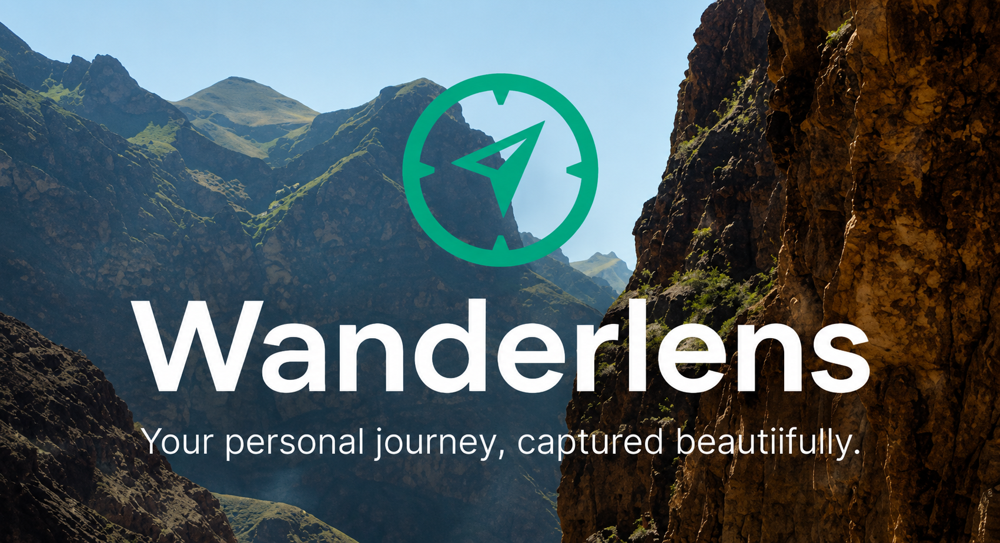
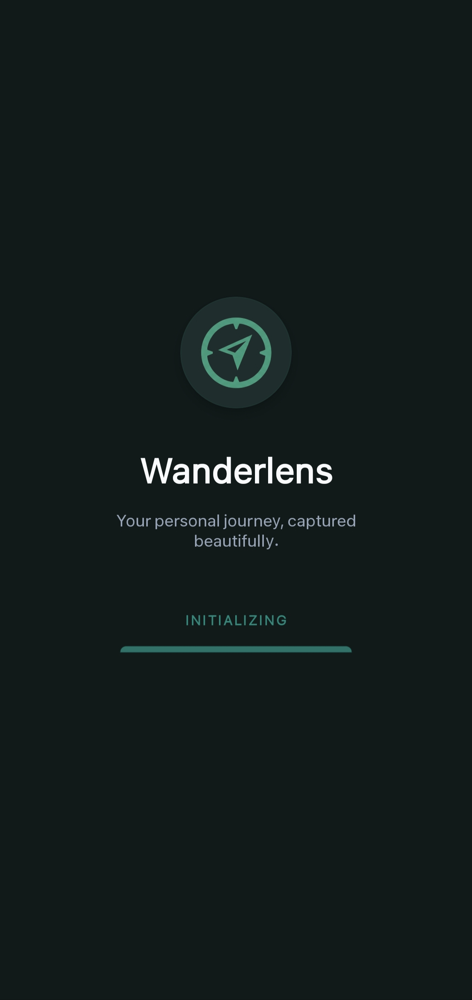
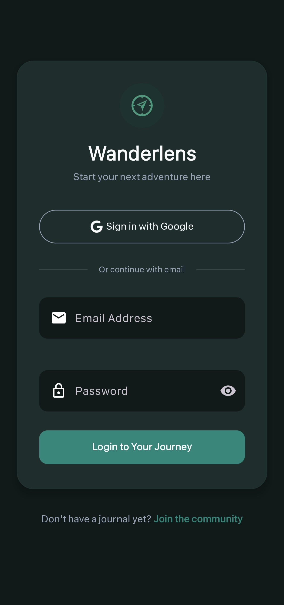
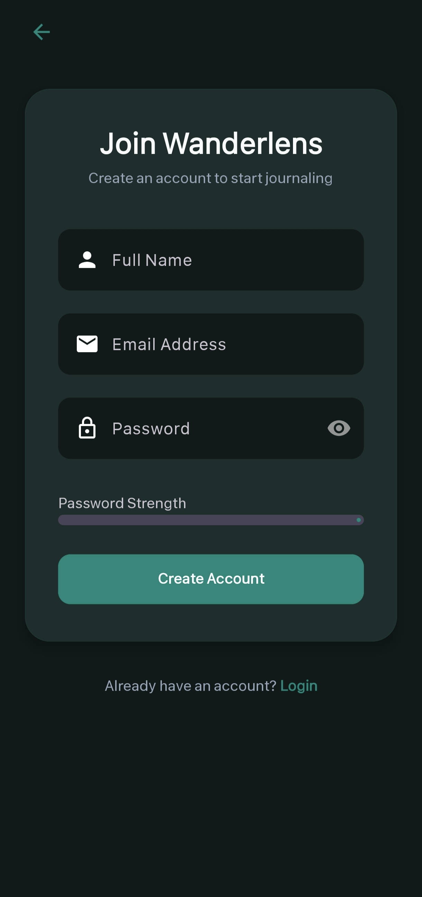
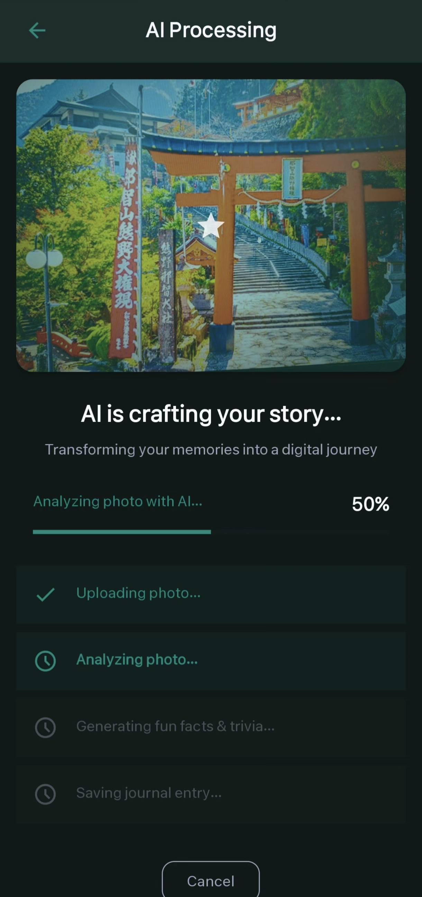
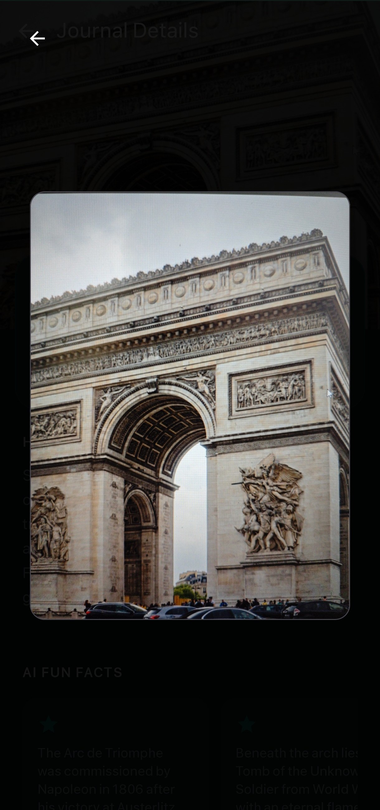

<p align="center">
  
</p>

<h1 align="center">WanderLens</h1>

<p align="center">
  <strong>Your personal journey, captured beautifully.</strong>
</p>

<p align="center">
  
  
  
  
  
  
  
</p>

---

**WanderLens** is a modern, AI-powered Android travel journal that transforms your photos into rich, narrated stories. Snap a photo of any landmark, and WanderLens uses **Google Gemini AI** to identify the location, craft a captivating description, and generate fun facts — all saved securely in the cloud.

---

## Screenshots

### Authentication

| Splash Screen | Login | Register |
| :---: | :---: | :---: |
|  |  |  |

### Core Experience

| Home Feed | Upload | AI Processing |
| :---: | :---: | :---: |
|  |  |  |

### Journal & Profile

| Journal Detail | Image Preview | Profile |
| :---: | :---: | :---: |
|  |  |  |

---

## Features

### AI-Powered Journaling
- Upload any travel photo and let **Google Gemini 2.5 Flash** analyze it
- Automatically generates a **poetic title**, **location**, **country**, **description**, and **fun facts**
- Retry logic with exponential backoff for API rate limits

### Smart Photo Management
- Upload photos from **Gallery** or capture with **Camera**
- Images stored on **Cloudinary CDN** for fast, reliable delivery
- Image compression before AI analysis to optimize performance
- Full-screen image preview with tap-to-zoom

### Secure Authentication
- **Email/Password** registration and login with validation
- **Google Sign-In** one-tap authentication
- Password strength indicator on registration
- Secure session management via Firebase Auth

### Rich Home Experience
- **Staggered grid layout** for a Pinterest-style journal feed
- **Pull-to-refresh** to sync latest entries
- **Search** journals by title, location, country, or description
- **Filter by country** using dynamic chip tags
- Auto-refresh after creating or deleting entries

### Detailed Journal View
- Collapsing toolbar with parallax header image
- Horizontally scrollable fun facts carousel with snap behavior
- **Delete journal** with confirmation dialog (removes from both Firebase and Cloudinary)
- Full-screen image preview overlay

### User Profile
- View account info and journal statistics (total entries, countries visited)
- Settings and sign-out functionality

### Premium UI/UX
- Dark glassmorphic design with Material Design 3 components
- Lottie animations for upload flow states
- Smooth transitions and micro-animations throughout
- Responsive layouts optimized for all screen sizes

---

## Architecture

The project follows the **MVVM (Model-View-ViewModel)** architecture pattern:

```
com.example.wanderlens/
├── data/
│   ├── model/          # Data classes (JournalEntry)
│   └── remote/         # Retrofit API interfaces & client
│       ├── RetrofitClient.kt
│       ├── CloudinaryApi.kt
│       ├── GeminiApi.kt
│       └── Models (Request/Response)
├── repository/
│   └── JournalRepository.kt   # Single source of truth for data operations
├── ui/
│   ├── auth/           # Login & Register fragments
│   ├── splash/         # Splash screen activity
│   ├── home/           # Home feed (Fragment + ViewModel + Adapter)
│   ├── upload/         # Upload & AI Processing fragments
│   ├── detail/         # Journal detail fragment
│   └── profile/        # Profile & Settings fragments
├── utils/
│   ├── Resource.kt     # Sealed class for Loading/Success/Error states
│   ├── ConfigProvider.kt
│   └── FirebaseConfig.kt
├── MainActivity.kt     # Single-activity host with Navigation Component
└── WanderLensApp.kt    # Application class
```

---

## Tech Stack

| Category | Technology |
|---|---|
| **Language** | Kotlin |
| **Architecture** | MVVM, Single Activity, Navigation Component |
| **UI** | Material Design 3, View Binding, ConstraintLayout |
| **Animations** | Lottie Animations |
| **Networking** | Retrofit 2, OkHttp 3, Gson |
| **Image Loading** | Glide |
| **Cloud Storage** | Cloudinary (image upload, CDN delivery, deletion) |
| **AI** | Google Gemini 2.5 Flash API |
| **Auth** | Firebase Authentication (Email + Google Sign-In) |
| **Database** | Cloud Firestore |
| **State Management** | StateFlow, LiveData, ViewModel |
| **Concurrency** | Kotlin Coroutines, Flow |

---

## Prerequisites

Before you begin, ensure you have:

- **Android Studio** Ladybug or newer (with SDK 36 support)
- **JDK 11** or higher
- A **Firebase** project configured for Android
- A **Google Gemini API Key** from [Google AI Studio](https://aistudio.google.com/)
- A **Cloudinary** account with Cloud Name, API Key, and API Secret

---

## Setup Guide

### 1. Clone the Repository

```bash
git clone https://github.com/Kishan8548/Wanderlens.git
cd Wanderlens
```

### 2. Configure Firebase

1. Go to the [Firebase Console](https://console.firebase.google.com/) and create a new project.
2. Add an Android app with the package name `com.example.wanderlens`.
3. Download the `google-services.json` file.
4. Place it inside the `app/` directory.
5. Enable **Authentication** (Email/Password and Google providers).
6. Enable **Cloud Firestore** in production mode.

### 3. Add API Keys

Open (or create) the `local.properties` file in the project root and add:

```properties
# Google Gemini API
GEMINI_API_KEY=your_gemini_api_key_here

# Cloudinary Configuration
CLOUDINARY_CLOUD_NAME=your_cloud_name
CLOUDINARY_API_KEY=your_api_key
CLOUDINARY_API_SECRET=your_api_secret
```

> **Security**: `local.properties` is git-ignored by default. Never commit API keys to version control.

### 4. Build and Run

1. Open the project in **Android Studio**.
2. Click **Sync Project with Gradle Files**.
3. Select a device/emulator (API 24+).
4. Click **Run** (`Shift + F10`).

---

## Firestore Data Model

Each user's journals are stored under:

```
users/{userId}/journals/{journalId}
```

| Field | Type | Description |
|---|---|---|
| `id` | String | Auto-generated document ID |
| `title` | String | AI-generated poetic title |
| `location` | String | Identified landmark or city |
| `country` | String | Identified country name |
| `description` | String | AI-crafted 2-sentence travel story |
| `imageUrl` | String | Cloudinary CDN URL of the photo |
| `funFacts` | List\<String\> | AI-generated fun facts about the location |
| `dateText` | String | Formatted date (e.g., "June 2026") |
| `timestamp` | Long | Epoch timestamp for sorting |

---

## App Flow

```
Splash Screen
    │
    ├── (Not logged in) ──> Login <──> Register
    │                          │
    │                     (Google / Email)
    │                          │
    └── (Logged in) ────────> Home Feed
                               │
                    ┌──────────┼──────────┐
                    │          │          │
                Upload    Detail     Profile
                    │          │          │
              AI Processing  Preview   Settings
                    │                    │
                (Auto-return           Logout
                 to Home)
```

---

## Contributing

Contributions are welcome!

1. Fork the repository
2. Create a feature branch (`git checkout -b feature/amazing-feature`)
3. Commit your changes (`git commit -m 'Add amazing feature'`)
4. Push to the branch (`git push origin feature/amazing-feature`)
5. Open a Pull Request

---

<p align="center">
  Made with care for travelers everywhere
</p>
